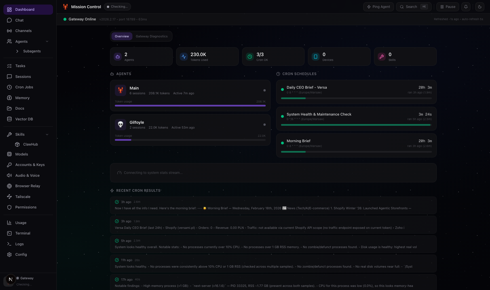
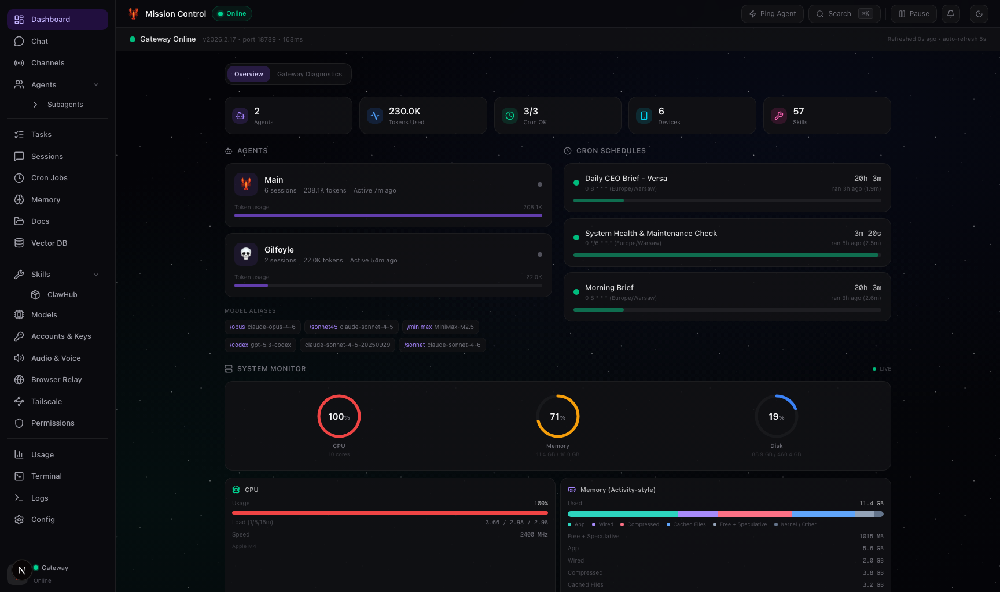
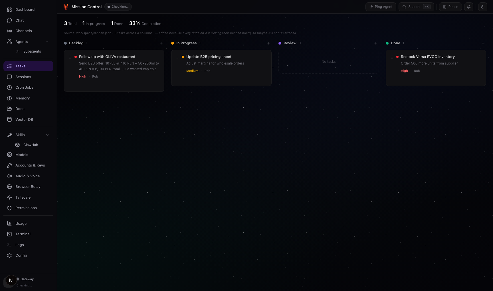
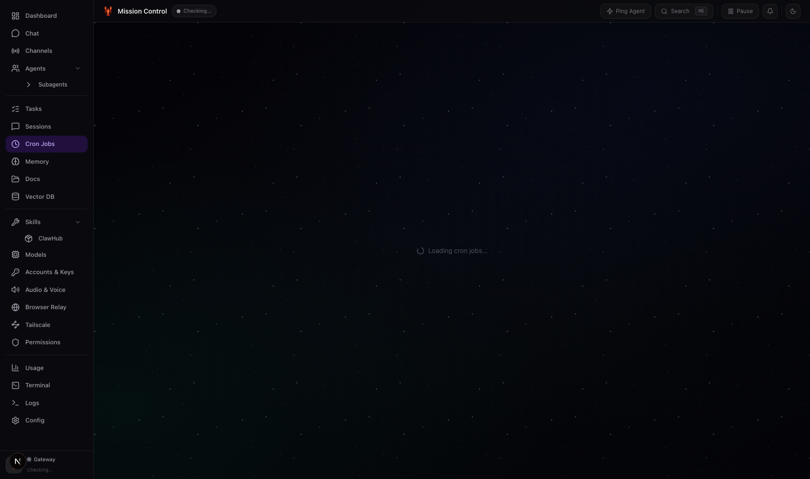
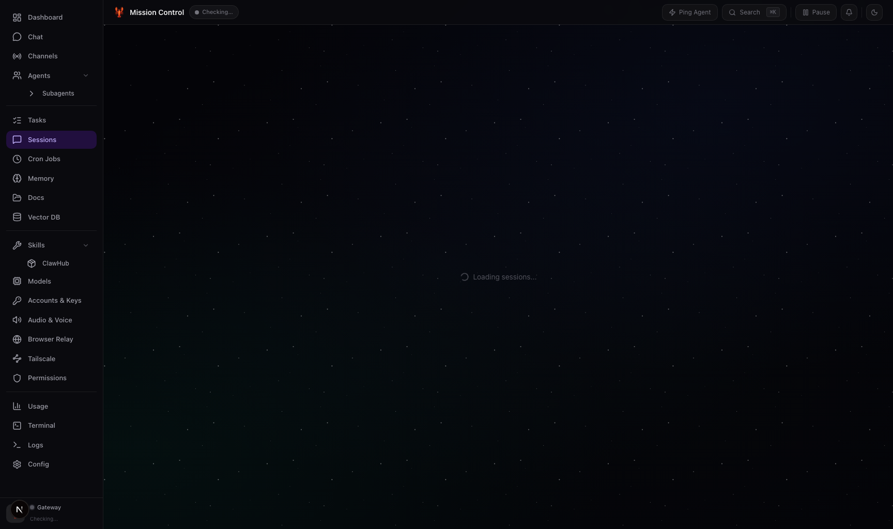
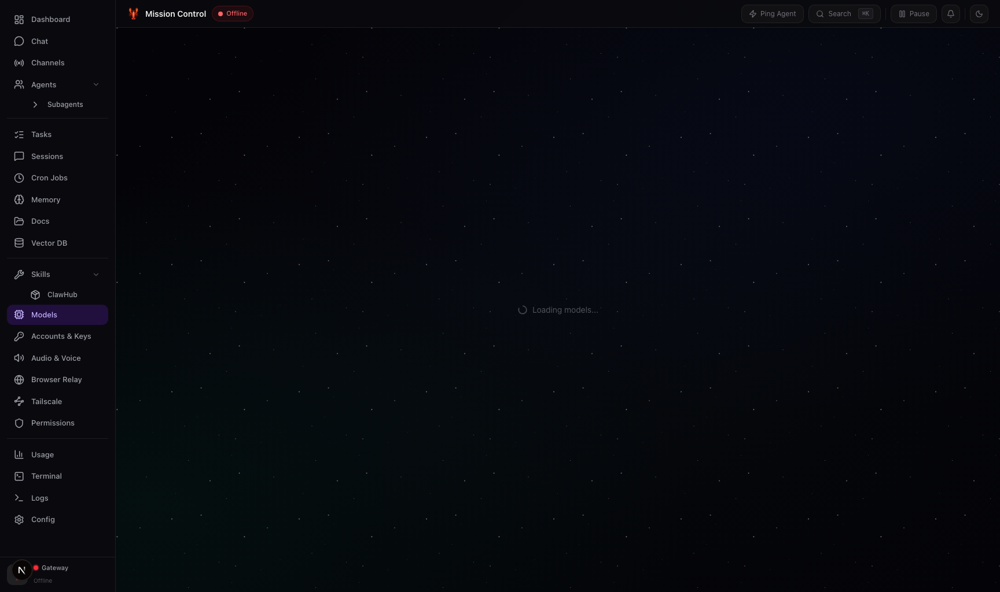
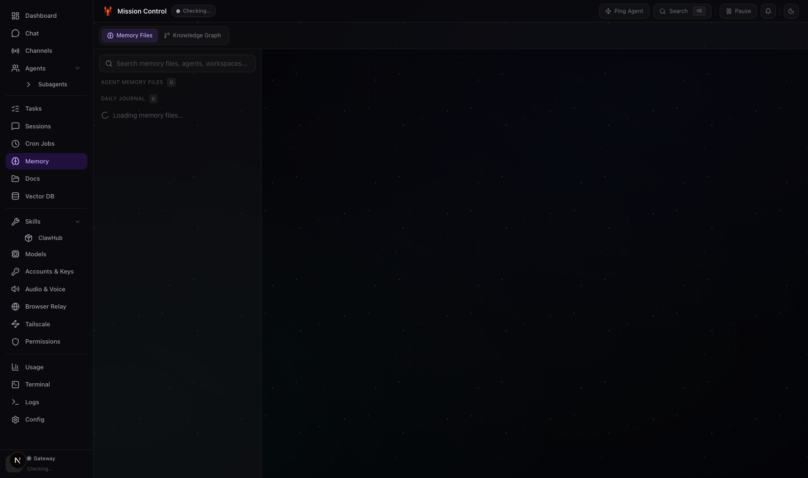
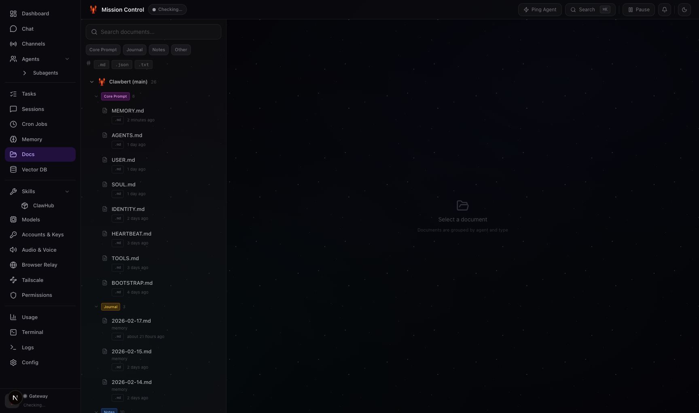

# Mission Control

**Your AI command center.**
A sleek dashboard to monitor, chat with, and manage your [OpenClaw](https://github.com/openclaw) agents — all from your browser.

    

---

## Quick Start

### Prerequisites

You need [OpenClaw](https://docs.openclaw.ai/install) installed first. If you don't have it:

```bash
curl -fsSL https://openclaw.ai/install.sh | bash
```

Verify it's working:

```bash
openclaw --version
```

### Install the Dashboard

Clone this repo **anywhere** (it auto-discovers your OpenClaw installation):

```bash
git clone https://github.com/robsannaa/openclaw-mission-control.git
cd openclaw-mission-control
npm install
npm run dev
```

Open `http://localhost:3000` — done!

> **Zero config needed.** The dashboard automatically finds your `~/.openclaw` directory and the `openclaw` binary.

---

## What is this?

Mission Control is a web dashboard that sits on top of [OpenClaw](https://github.com/openclaw). Think of it as the cockpit for your AI agent system.

| Feature | Description |
|---|---|
| **Dashboard** | See everything at a glance: gateway status, active agents, cron jobs, and live system stats |
| **Agents** | Visualize your agent hierarchy, models, channels, and workspaces |
| **Chat** | Talk to your OpenClaw agents directly from the browser |
| **Tasks** | Built-in Kanban board that syncs with your workspace |
| **Memory** | Edit your agent's long-term memory and daily journal |
| **Cron Jobs** | View, create, edit, enable/disable, and trigger scheduled tasks |
| **Usage** | Deep analytics on model usage, tokens, sessions, and costs |
| **Models** | Manage primary/fallback models with drag-and-drop reordering |
| **Vector Memory** | Browse and search your semantic memory (like Pinecone, but local) |
| **System** | Real-time CPU, memory, disk, skills, devices, and config management |
| **Documents** | Browse workspace docs across all agents |
| **Search** | `Cmd+K` semantic search powered by OpenClaw's vector DB |

Everything runs locally. No cloud. No data leaves your machine.

---

## Screenshots

### Dashboard

*Real-time overview of your agents, gateway status, and system metrics*

### Tasks

*Kanban board synchronized with your workspace*

### Cron Jobs

*Manage and monitor scheduled tasks*

### Sessions

*Chat history and agent interactions*

### System

*CPU, memory, skills, and device management*

### Memory

*Edit long-term memory and daily journal*

### Documents

*Browse workspace documentation*

---

## Let OpenClaw Install It For You

Already have OpenClaw running? Just ask your agent:

```
Hey, install Mission Control for me — here's the repo: https://github.com/robsannaa/openclaw-mission-control
```

Your agent will:
1. Clone this repo to your workspace
2. Run `npm install`
3. Start the dev server
4. Open it in your browser

---

## How It Works

Mission Control **auto-discovers** your OpenClaw installation at startup. No configuration needed.

**What it finds automatically:**

1. **OpenClaw binary** — checks `which openclaw`, then common paths like `/opt/homebrew/bin/openclaw`
2. **Home directory** — looks at `~/.openclaw` (or `OPENCLAW_HOME` env var if set)
3. **Agents** — reads `openclaw.json` and scans agent directories
4. **Workspaces** — discovers all workspace directories from your config

**You can clone this repo anywhere.** It doesn't need to be inside `~/.openclaw` or any specific location.

---

## Troubleshooting

### "OpenClaw not found"

The dashboard couldn't find the `openclaw` binary. Make sure it's installed and in your PATH:

```bash
openclaw --version
```

If that works but the dashboard still complains, set the path explicitly:

```bash
OPENCLAW_BIN=$(which openclaw) npm run dev
```

### Port 3000 already in use

Change the port:

```bash
npm run dev -- --port 8080
```

---

## Environment Variables (optional)

Everything auto-discovers, but you can override if needed:

| Variable | Default | Description |
|---|---|---|
| `OPENCLAW_HOME` | `~/.openclaw` | Path to your OpenClaw home directory |
| `OPENCLAW_BIN` | Auto-detected | Path to the `openclaw` binary |
| `OPENCLAW_WORKSPACE` | Auto-detected | Path to the default workspace |
| `OPENCLAW_SKILLS_DIR` | Auto-detected | Path to system skills directory |


## Project Structure

```
dashboard/
├── src/
│   ├── app/
│   │   ├── api/             # Backend API routes
│   │   ├── page.tsx         # Main app shell
│   │   └── layout.tsx       # Root layout + theme
│   ├── components/          # UI components
│   ├── hooks/               # React hooks
│   └── lib/
│       ├── paths.ts         # Self-discovery logic
│       └── openclaw-cli.ts  # CLI & gateway wrapper
├── public/                  # PWA manifest & service worker
├── package.json
└── next.config.ts
```

---

## FAQ

<details>
<summary><strong>"command not found: openclaw" — what do I do?</strong></summary>

Make sure OpenClaw is installed and the `openclaw` binary is in your PATH:

```bash
openclaw --version
```

If that doesn't work, [install OpenClaw first](https://docs.openclaw.ai/install).
</details>

<details>
<summary><strong>Can I run this on a remote server?</strong></summary>

Yes! Clone it on any machine where OpenClaw is installed:

```bash
git clone https://github.com/robsannaa/openclaw-mission-control.git
cd openclaw-mission-control
npm install
npm run dev -- --port 8080
```

For remote access via SSH:

```bash
ssh -N -L 3000:127.0.0.1:3000 user@your-server
```
</details>

<details>
<summary><strong>Does this send my data anywhere?</strong></summary>

No. Everything runs locally. Mission Control talks to your local OpenClaw installation through the CLI and gateway RPC. No data leaves your computer.
</details>

<details>
<summary><strong>Can I use this with multiple OpenClaw instances?</strong></summary>

Yes — set `OPENCLAW_HOME` to point at a different instance:

```bash
OPENCLAW_HOME=/path/to/other/.openclaw npm run dev -- --port 3001
```
</details>

---

## Tech Stack

| Layer | Tech |
|---|---|
| Framework | [Next.js 16](https://nextjs.org) |
| UI | [React 19](https://react.dev), [Tailwind CSS 4](https://tailwindcss.com), [shadcn/ui](https://ui.shadcn.com), [Radix UI](https://radix-ui.com) |
| AI | [Vercel AI SDK](https://sdk.vercel.ai) |
| Icons | [Lucide](https://lucide.dev) |
| Markdown | [react-markdown](https://github.com/remarkjs/react-markdown) |
| Testing | [Playwright](https://playwright.dev) |

---

## Contributing

Pull requests are welcome! If you find a bug or have a feature idea, [open an issue](https://github.com/openclaw/dashboard/issues).

---

## License

MIT
